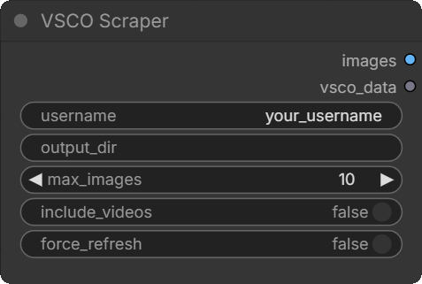
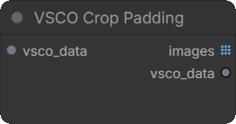

# comfyui-vsco-scraper

A ComfyUI custom node pack that scrapes all images from a public VSCO profile and provides utilities for selecting and cropping them within a workflow.

Built on top of [vsco-downloader](https://github.com/NickJGG/vsco-downloader).

## How it works

VSCO uses Cloudflare bot protection. This pack connects to a real Chrome browser via the Chrome DevTools Protocol (CDP) and uses Playwright to intercept network responses as the gallery scrolls, collecting media items and downloading them to disk. Downloaded images are then loaded as ComfyUI `IMAGE` tensors.

Since ComfyUI runs inside an asyncio event loop and Playwright's sync API cannot run inside one, all browser work is dispatched to a plain worker thread via `ThreadPoolExecutor`.

Images are padded to uniform dimensions before being stacked into a batch, since VSCO photos vary in resolution. Original dimensions are tracked in a `VSCO_SIZES` bundle so they can be recovered without distortion.

---

## Requirements

- Google Chrome
- Python packages:

```bash
pip install -r requirements.txt
playwright install chromium
```

---

## Installation

Clone into your ComfyUI `custom_nodes` directory and restart ComfyUI:

```bash
cd ComfyUI/custom_nodes
git clone https://github.com/liquid-night/comfyui-vsco-scraper
```

---

## Environment variables

These can be set as system environment variables or in a `.env` file in the node directory.

| Variable | Default | Description |
|----------|---------|-------------|
| `CHROME_EXE` | auto-detected | Path to the Chrome executable. Set this if Chrome is not found automatically. |
| `CHROME_PORT` | `9222` | Remote debugging port used to connect to Chrome via CDP. |
| `CHROME_SOURCE_PROFILE` | — | Path to an existing Chrome profile to copy for fingerprinting purposes. |

---

## Nodes

All nodes are found under the **VSCO** category in the node browser.

---

### VSCO Scraper

Scrapes a VSCO profile and returns images as a padded batch.



**Inputs**

| Name | Type | Default | Required | Description |
|------|------|---------|----------|-------------|
| `username` | STRING | — | Yes | VSCO username. The `@` prefix is stripped automatically. |
| `output_dir` | STRING | `%TEMP%/vsco-downloads/<username>` | No | Directory to save downloaded images. Images persist between runs and are re-used if sufficient. |
| `max_images` | INT | `0` | No | Maximum number of images to scrape and return. `0` = all. If the cached image count on disk is already ≥ `max_images`, scraping is skipped. |
| `include_videos` | BOOLEAN | `false` | No | Also download video posts. |
| `force_refresh` | BOOLEAN | `false` | No | Re-scrape even if enough images already exist on disk. |

**Outputs**

| Name | Type | Description |
|------|------|-------------|
| `images` | IMAGE | Padded batch tensor `[B, H, W, C]`. All images are padded to the largest dimensions in the set. Black bars appear where images are smaller than the batch maximum. |
| `vsco_data` | VSCO_SIZES | A bundle carrying both the padded batch and the original `(H, W)` per image. Pass this to **VSCO Crop Padding** or **VSCO Select Image** to recover original dimensions. |

**Caching**

The node output is cached by ComfyUI between queue runs as long as all inputs remain the same. Changing any input (including `max_images`) invalidates the cache and triggers a fresh execution.

If enough images already exist on disk (`len(cached) >= max_images`, or `max_images == 0`), Chrome is never opened and images are loaded directly from disk.

**First run / session expiry**

On the first run, or when the VSCO session has expired, the node prints instructions in the ComfyUI console:

```
[VSCO Scraper] Open Chrome and navigate to:
  https://vsco.co/<username>/gallery
  Scroll until photos appear, then return to ComfyUI.
```

Open the Chrome window that launched automatically, navigate to the gallery, scroll until photos begin loading, then switch back to ComfyUI. The node detects the activity and continues automatically. The session is cached so this only happens once.

Chrome is closed automatically when scraping finishes.

**Download progress**

A progress bar is shown on the node in the ComfyUI UI during the download phase, updating per image via `comfy.utils.ProgressBar`.

---

### VSCO Crop Padding

Removes the black padding added by the scraper and returns each image at its original resolution.



**Inputs**

| Name | Type | Default | Description |
|------|------|---------|-------------|
| `vsco_data` | VSCO_SIZES | — | The `vsco_data` output from **VSCO Scraper** or from this node chained. |

**Outputs**

| Name | Type | Description |
|------|------|-------------|
| `images` | IMAGE list | Each image cropped to its original `(H, W)`. Output is a list — images have varying dimensions and cannot be batched. Connect to a **For Each** loop or **Rebatch** node. |
| `vsco_data` | VSCO_SIZES | The cropped images bundled with their sizes. Pass to **VSCO Select Image** to select a single image from the cropped set. |

---

### VSCO Select Image

Selects a single image at a given index from a VSCO batch or cropped set.


**Inputs**

| Name | Type | Default | Description |
|------|------|---------|-------------|
| `vsco_data` | VSCO_SIZES | — | The `vsco_data` output from **VSCO Scraper** or **VSCO Crop Padding**. |
| `index` | INT | `0` | Zero-based index of the image to return. |

**Outputs**

| Name | Type | Description |
|------|------|-------------|
| `image` | IMAGE | The selected image as `[1, H, W, C]`. If the source is the scraper (padded), padding is cropped automatically. If the source is the crop node, the image is already at native resolution. |

---

## Typical workflows

**Process all images individually at native resolution:**
```
VSCO Scraper → vsco_data → VSCO Crop Padding → images (list) → For Each Open → [nodes] → For Each Close
```

**Select one image by index:**
```
VSCO Scraper → vsco_data → VSCO Select Image (index=N) → [nodes]
```

**Select one image after cropping:**
```
VSCO Scraper → vsco_data → VSCO Crop Padding → vsco_data → VSCO Select Image (index=N) → [nodes]
```

**Use the padded batch directly with other nodes:**
```
VSCO Scraper → images → [any standard IMAGE node]
```
